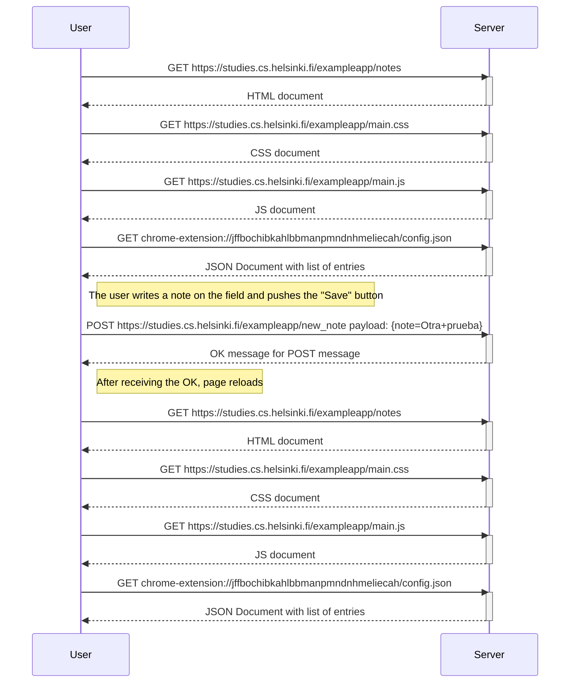
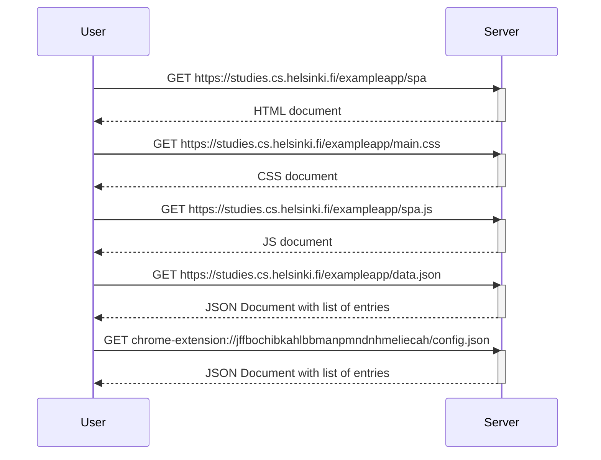
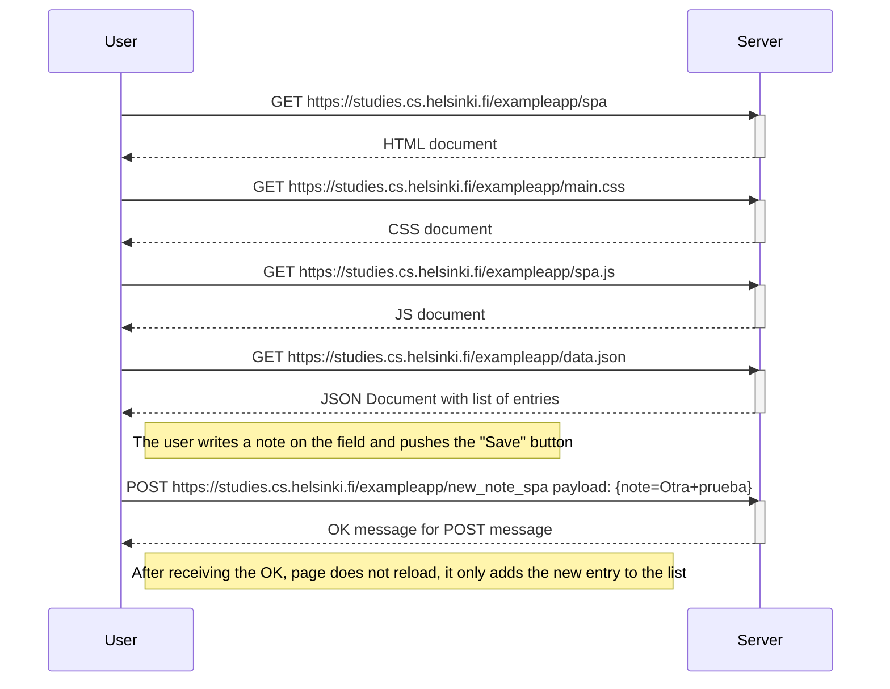

# full-stack-course-part-0

# Exercise 0.4

```mermaid
sequenceDiagram
  participant User
  participant Server

  User->>Server: GET https://studies.cs.helsinki.fi/exampleapp/notes
  activate Server
  Server-->>User: HTML document
  deactivate Server

  User->>Server: GET https://studies.cs.helsinki.fi/exampleapp/main.css
  activate Server
  Server-->>User: CSS document
  deactivate Server

  User->>Server: GET https://studies.cs.helsinki.fi/exampleapp/main.js
  activate Server
  Server-->>User: JS document
  deactivate Server

  User->>Server: GET chrome-extension://jffbochibkahlbbmanpmndnhmeliecah/config.json
  activate Server
  Server-->>User: JSON Document with list of entries
  deactivate Server


  Note right of User: The user writes a note on the field and pushes the "Save" button

  User->>Server: POST https://studies.cs.helsinki.fi/exampleapp/new_note payload: {note=Otra+prueba}
  activate Server
  Server-->>User: OK message for POST message
  deactivate Server

  Note right of User: After receiving the OK, page reloads

  User->>Server: GET https://studies.cs.helsinki.fi/exampleapp/notes
  activate Server
  Server-->>User: HTML document
  deactivate Server

  User->>Server: GET https://studies.cs.helsinki.fi/exampleapp/main.css
  activate Server
  Server-->>User: CSS document
  deactivate Server

  User->>Server: GET https://studies.cs.helsinki.fi/exampleapp/main.js
  activate Server
  Server-->>User: JS document
  deactivate Server

  User->>Server: GET chrome-extension://jffbochibkahlbbmanpmndnhmeliecah/config.json
  activate Server
  Server-->>User: JSON Document with list of entries
  deactivate Server


```

# Exercise 0.5

```mermaid
sequenceDiagram
  participant User
  participant Server

  User->>Server: GET https://studies.cs.helsinki.fi/exampleapp/spa
  activate Server
  Server-->>User: HTML document
  deactivate Server

  User->>Server: GET https://studies.cs.helsinki.fi/exampleapp/main.css
  activate Server
  Server-->>User: CSS document
  deactivate Server

  User->>Server: GET https://studies.cs.helsinki.fi/exampleapp/spa.js
  activate Server
  Server-->>User: JS document
  deactivate Server

  User->>Server: GET https://studies.cs.helsinki.fi/exampleapp/data.json
  activate Server
  Server-->>User: JSON Document with list of entries
  deactivate Server

  User->>Server: GET chrome-extension://jffbochibkahlbbmanpmndnhmeliecah/config.json
  activate Server
  Server-->>User: JSON Document with list of entries
  deactivate Server

  

```

# Exercise 0.6

```mermaid
sequenceDiagram
  participant User
  participant Server

  User->>Server: GET https://studies.cs.helsinki.fi/exampleapp/spa
  activate Server
  Server-->>User: HTML document
  deactivate Server

  User->>Server: GET https://studies.cs.helsinki.fi/exampleapp/main.css
  activate Server
  Server-->>User: CSS document
  deactivate Server

  User->>Server: GET https://studies.cs.helsinki.fi/exampleapp/spa.js
  activate Server
  Server-->>User: JS document
  deactivate Server

  User->>Server: GET https://studies.cs.helsinki.fi/exampleapp/data.json
  activate Server
  Server-->>User: JSON Document with list of entries
  deactivate Server
  

  Note right of User: The user writes a note on the field and pushes the "Save" button

  User->>Server: POST https://studies.cs.helsinki.fi/exampleapp/new_note_spa payload: {note=Otra+prueba}
  activate Server
  Server-->>User: OK message for POST message
  deactivate Server

  Note right of User: After receiving the OK, page does not reload, it only adds the new entry to the list

```
